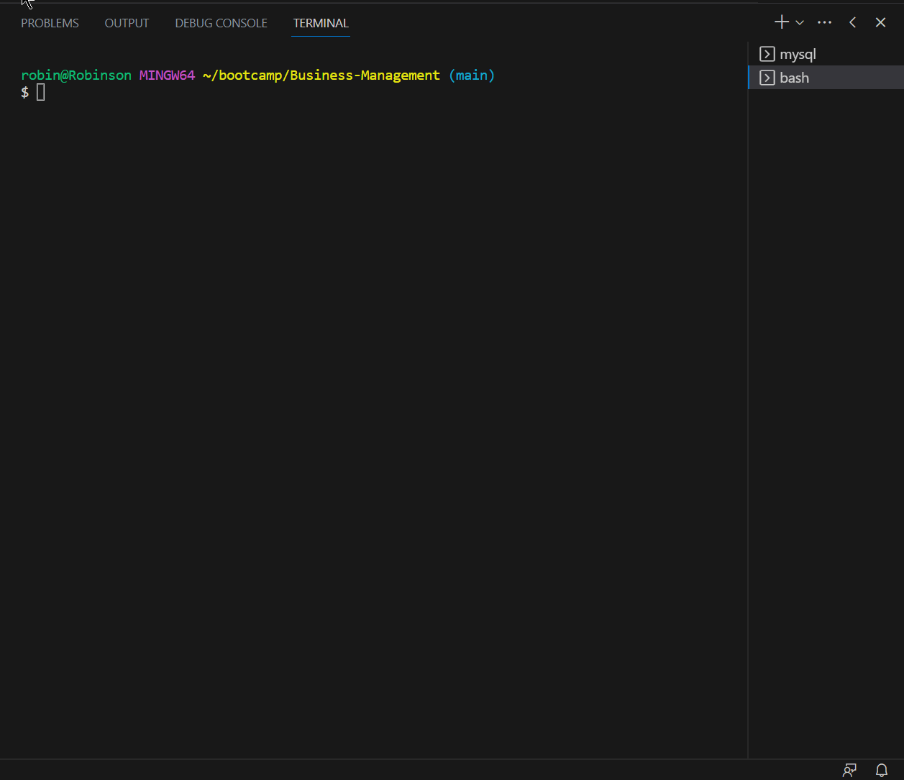
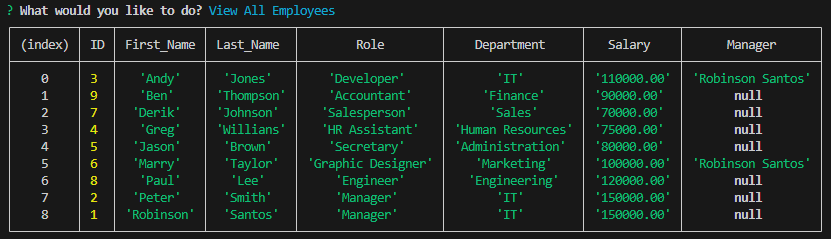

# Business Management

  ## Description

This project was developed to help entrepreneurs manage their employees and consequently create an organized hierarchy in their company, where they can add, remove and reallocate employees, in addition to being able to define functions, departments and define a salary according to their role.

  ## Table of Contents
  - [Installation](#installation)
  - [Usage](#usage)
  - [License](#license)
  - [Contributing](#contributing)
  - [Credits](#credits)
  - [Questions](#questions)
  
  ## Installation

  Navigate to https://github.com/robinsonfdossantos/Business-Management.

  Open a local built-in Terminal (powershell, bash) on your local machine.

  Navigate to a desired folder to place your project in, using 'cd "folder"'.

  Use 'git clone' to copy the repository to your local computer by typing "git clone git@github.com:robinsonfdossantos/Business-Management.git".
  
  ## Usage

  Run the terminal built into VS Code. Make sure you have installed all required packages using 'npm install or npm i'.
  
  Before running the program make sure you run the database by typing 'mysql -u root -p' and after entering your password type 'source schema.sql;' to create the database or load it again. You can also run 'source seed.sql;' to populate your database as an example to better understand how the application works. Make sure you have navigated to the right path in the terminal to run the database, for example './Business-Management/db'.

  Then open a new terminal and run the program using the command 'node server.js or npm start'.

  When the application loads, you will be presented with a list of options as shown in the animation below.

  In this example, I loaded my seed.sql file to populate my database and demonstrate some select queries to query existing departments and roles.

  
  
  In addition, you can consult all the company's employees and be presented with all their information as shown in the table below.

  

  The following link is related to a video of the application in operation, watching it you will be able to go through the options provided by the application and also follow the steps to start the application if you still have doubts.

  https://drive.google.com/file/d/1-S6G0ldEfinHyFGN--7Aw3AyGptzSTnM/view

  ## License

  This application is covered under the MIT license.
  
  ## Contributing

  All users are very welcome to leave their comments and suggestions for improvement by sending me a direct message or creating pull requests on Github.
  
  ## Credits

  MySql
 
  Meeks Gombe, Dominique who helped me to understand and overcome all my doubts through a 1:1 tutor session.
 
  Boot camp members who provided the structure codes.
  
  ## Questions

  For any questions or inquiries, please reach out to me via [GitHub](https://github.com/robinsonfdossantos) or email me at robinsonfdossantos@gmail.com.
  

